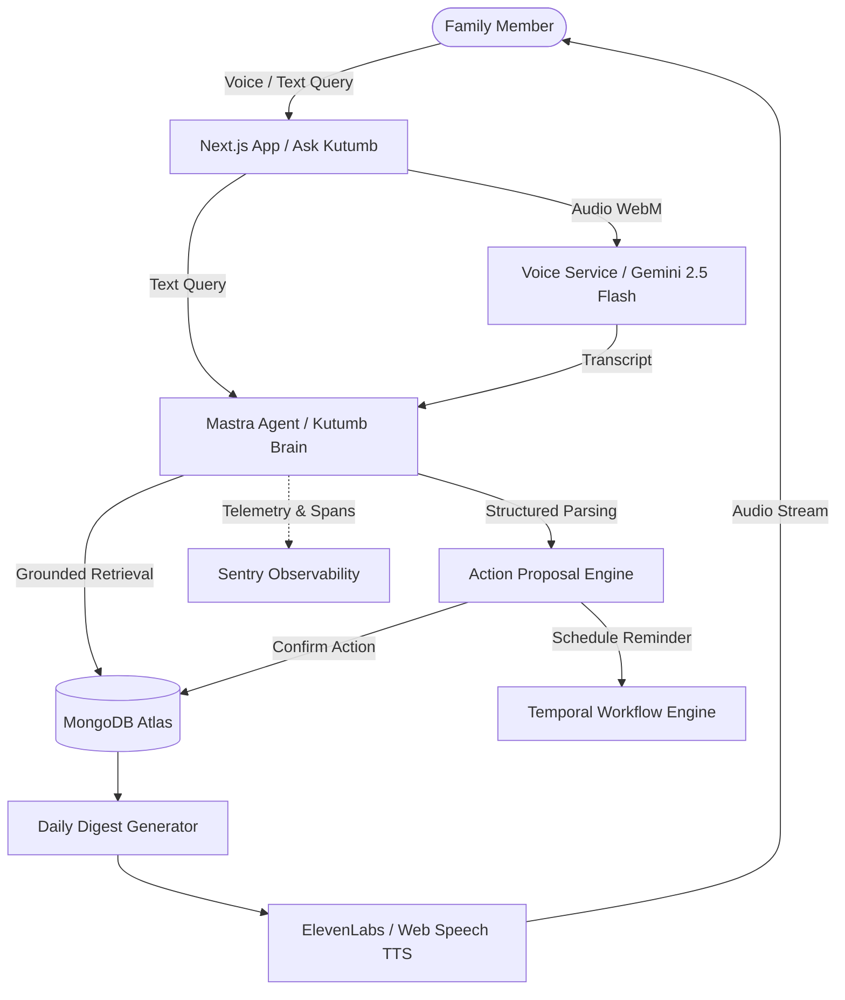

<div align="center">

# 🏡 Kutumb (कुटुंब)
### *Your Family's Shared Memory and Coordination Layer*

[](https://kutumb-k66g.onrender.com/)

[](https://nextjs.org/)
[](https://ai.google.dev/)
[](https://mastra.ai/)
[](https://www.mongodb.com/atlas)
[](https://temporal.io/)
[](https://elevenlabs.io/)
[](https://sentry.io/)

🔗 **Live Website:** [https://kutumb-k66g.onrender.com](https://kutumb-k66g.onrender.com/)

</div>

---

## 📖 Overview

Family information is frequently fragmented across WhatsApp chats, sticky notes, missed calls, calendar apps, and human memory:
- *"When was the electrician supposed to visit?"*
- *"Who is picking up the cake on Sunday?"*
- *"Did Dad mention his flight time?"*
- *"What did we decide about the weekend trip?"*

**Kutumb** is an AI-powered shared family memory and coordination web application. It acts as a central hub where family members can share events, tasks, reminders, and preferences using natural voice or conversational text.

Powered by Google's **Gemma** and **Gemini** models through **Mastra** agent orchestration, Kutumb automatically parses complex, multi-intent requests, grounds factual answers strictly in stored family data, schedules durable reminders via **Temporal**, and delivers spoken daily audio digests via **ElevenLabs** and Web Speech.

---

## ✨ Key Features

- **🗣️ Spoken Voice Updates & Multi-Intent Parsing**:
  - Speak naturally (e.g. *"1. Add dinner with the family on Sunday at 7. 2. Create a task to pick up the cake."*).
  - Automatically segments compound inputs into distinct structured events, tasks, reminders, and memory notes.
- **🛡️ Confirm-Before-Write Action Proposals**:
  - The AI parses unstructured input into pending action proposals before committing them to the database, ensuring zero silent errors or accidental overwrites.
- **🔍 "Ask Kutumb" Grounded Search**:
  - Ask questions in plain English or Hindi mix (e.g. *"What's happening tomorrow?"*, *"When is Mom's birthday?"*).
  - Answers are strictly grounded in family records stored in MongoDB Atlas with zero hallucinations.
- **⏰ Durable Workflows & Reminders (Temporal.io)**:
  - Reminders scheduled through Temporal workflows survive server restarts, worker crashes, and network timeouts.
- **🧠 Family Memory & Preferences**:
  - A persistent knowledge base storing birthdays, dietary preferences, decisions, and household notes.
- **🎙️ Daily Audio Digest (ElevenLabs + Web Speech)**:
  - Generates a concise daily summary of today's schedule, open tasks, and recent updates with one-click voice playback.
- **📊 Activity Timeline & Central Hub**:
  - A chronological feed of family actions, announcements, and coordination updates.

---

## 🏗️ Architecture & Flow



---

## 🛠️ Technology Stack

| Layer | Technology | Purpose |
| :--- | :--- | :--- |
| **Frontend & API** | Next.js 15 (App Router, React 19) | Fullstack modern application with server actions & API routes |
| **Styling & UI** | Tailwind CSS v4 | Warm, family-oriented, accessible design system |
| **Reasoning & Agent** | Gemma / Gemini 2.5 Flash + Mastra | Intent recognition, tool selection, structured extraction, summarization |
| **Database** | MongoDB Atlas | Document store for users, families, events, tasks, memories, & digests |
| **Durable Execution** | Temporal.io | Resilient, distributed reminder and workflow execution |
| **Voice & Speech** | ElevenLabs API + Web Speech API | High-quality audio digest synthesis and voice input handling |
| **Observability** | Sentry | End-to-end tracing across AI model calls, tools, and workflows |
| **Deployment** | Render | Production web hosting and background worker deployment |

---

## 🚀 Getting Started

### Prerequisites

- **Node.js** (v20 or higher)
- **MongoDB Atlas** cluster (or local MongoDB 6.0+)
- **Google Gemini API Key** (from [Google AI Studio](https://aistudio.google.com/))
- **Temporal Server** (Local via `temporal server start-dev` or [Temporal Cloud](https://cloud.temporal.io/))
- *(Optional)* **ElevenLabs API Key** for ultra-realistic neural TTS

---

### Installation & Local Setup

1. **Clone the repository**:
   ```bash
   git clone https://github.com/cyc1otr0n/kutumb-1.0.git
   cd kutumb-1.0
   ```

2. **Install dependencies**:
   ```bash
   npm install
   ```

3. **Configure Environment Variables**:
   Create a `.env` file in the root directory:
   ```bash
   cp .env.example .env
   ```
   Fill in your API credentials:
   ```env
   # Application & Auth
   NODE_ENV=development
   PORT=3000
   SESSION_SECRET=your-random-32-plus-character-secret-key-here

   # Database
   MONGODB_URI=mongodb+srv://<username>:<password>@cluster0.mongodb.net/?retryWrites=true&w=majority
   MONGODB_DB=kutumb

   # AI & Voice
   GOOGLE_GENERATIVE_AI_API_KEY=AIzaSy...
   GEMMA_MODEL=gemma-4-26b-a4b-it

   # Optional ElevenLabs TTS
   ELEVENLABS_API_KEY=your_elevenlabs_key
   ELEVENLABS_VOICE_ID=21m00Tcm4TlvDq8ikWAM

   # Temporal Workflow Engine
   TEMPORAL_ADDRESS=localhost:7233
   TEMPORAL_NAMESPACE=default
   TEMPORAL_TASK_QUEUE=kutumb-reminders

   # Sentry Observability (Optional)
   SENTRY_DSN=https://examplePublicKey@o0.ingest.sentry.io/0
   ```

4. **Seed Sample Data (Optional)**:
   ```bash
   npm run seed
   ```

5. **Run Verification Test Suite**:
   ```bash
   npm run test:verify
   ```

6. **Start Temporal Worker (Optional for Reminders)**:
   ```bash
   npm run worker
   ```

7. **Start Development Server**:
   ```bash
   npm run dev
   ```

Open [http://localhost:3000](http://localhost:3000) in your browser.

---

## 🧪 Testing & Verification

Kutumb includes an automated end-to-end verification script testing all core PRD demo scenarios (timezones, password hashing, compound intent parsing, grounded question-answering, action confirmations, and daily digest generation):

```bash
npm run test:verify
```

---

## ☁️ Deployment (Render)

Kutumb is live in production on Render:
👉 **[https://kutumb-k66g.onrender.com](https://kutumb-k66g.onrender.com)**

Continuous deployment is automated using the included `render.yaml` specification.

### Render Environment Checklist:
1. **`SESSION_SECRET`**: Set to a 32+ character random string (e.g. generated via `node -e "console.log(require('crypto').randomBytes(32).toString('hex'))"`).
2. **`MONGODB_URI`**: Ensure `0.0.0.0/0` (Allow Access from Anywhere) is configured in **MongoDB Atlas $\rightarrow$ Network Access**.
3. **`GOOGLE_GENERATIVE_AI_API_KEY`**: Set your Gemini API key.
4. **`NODE_ENV`**: Set to `production`.

---

## 🛡️ Safety & Trust Principles

- **No Medical/Emergency Scope**: Kutumb is strictly for family coordination. It does not provide medical diagnosis, health monitoring, or emergency response.
- **Zero Hallucinations on Family Records**: When answering questions about schedules or memories, the AI only answers using confirmed data stored in MongoDB.
- **Privacy First**: Data is partitioned strictly by `familyId`. One family's data is never accessible or leaked to another.

---

## 📄 License

Private - All rights reserved.
